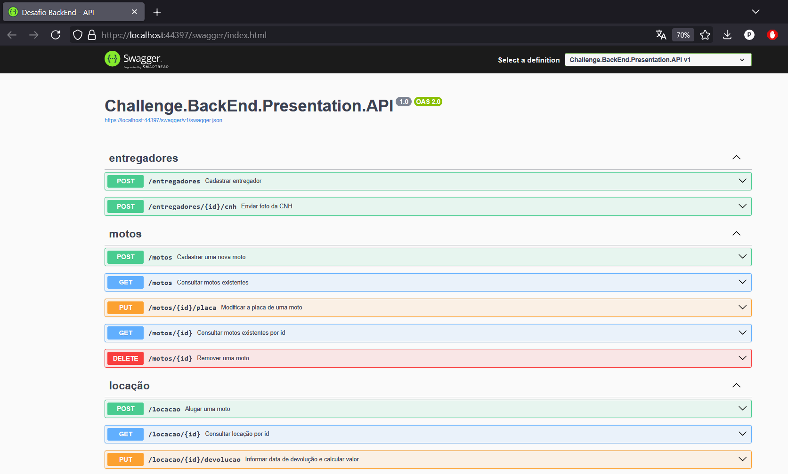

# Descrição
Aplicação para gerenciar aluguel de motos e entregadores. 

# Requisitos não funcionais

 - A aplicação deverá ser construida com .Net utilizando C#.
 - Utilizar apenas os seguintes bancos de dados (Postgress, MongoDB)
   - Não utilizar PL/pgSQL
 - Escolha o sistema de mensageria de sua preferencia( RabbitMq, Sqs/Sns , Kafka, Gooogle Pub/Sub ou qualquer outro)

## Passos para rodar a aplicação local

1. Clone o repositório:

    git clone https://github.com/javarottiProgramming/Desafio-BackEnd.git

2. Restaure as dependências do projeto:

  
3. Configure o banco de dados:
    1. Crie o banco de dados no PostgreSQL a partir dos scripts abaixo (execute em ordem).
        1. [1-Create Database](scripts-database/1-Create Database.sql)
        1. [2 - Create User](scripts-database/2 - Create User.sql)
        1. [3 - Create tables](scripts-database/3 - Create tables.sql)
        1. [4 - Insert database default](scripts-database/4 - Insert database default.sql)

4. Configure a string de conexão com sistema de mensageria RabbitMQ em appSettings:

5. Rode a aplicação no perfil pré-configurado "challenge":

# Swagger API

## Casos de uso Moto

- [x] Eu como usuário admin quero cadastrar uma nova moto.
    - [x] Os dados obrigatórios da moto são Identificador, Ano, Modelo e Placa
	    - [Evidência campos obrigatórios - Requisição](evidence-imgs/moto_1.png)
    - [x] A placa é um dado único e não pode se repetir.
	    - [Evidência placa unique - Base de dados](evidence-imgs/moto_2.png)
	    - [Evidência placa unique - Requisição](evidence-imgs/moto_3.png)
    - [x] Quando a moto for cadastrada a aplicação deverá gerar um evento de moto cadastrada
        - [x] A notificação deverá ser publicada por mensageria.
          - [Evidência Cadastro Moto 2020 - Mensagem recebida](evidence-imgs/moto_5.png)
        - [x] Criar um consumidor para notificar quando o ano da moto for "2024"
          - [Evidência Cadastro Moto 2024 - Mensagem recebida e notificação enviada](evidence-imgs/moto_4.png)
        - [x] Assim que a mensagem for recebida, deverá ser armazenada no banco de dados para consulta futura.
          - [Evidência Consultar Moto - Requisição](evidence-imgs/moto_6.png)
             
## Casos de uso Entregador

- [x] Eu como usuário entregador quero me cadastrar na plataforma para alugar motos.
    - [x] Os dados do entregador são( identificador, nome, cnpj, data de nascimento, número da CNHh, tipo da CNH, imagemCNH)
	    - [x] Os tipos de cnh válidos são A, B ou ambas A+B.
			- [Evidência cadastro entregador CNH inválida - Requisição](evidence-imgs/entregador_1.png)
    - [x] O cnpj é único e não pode se repetir.
    - [x] O número da CNH é único e não pode se repetir.
  		- [Evidência dados existentes entregador](evidence-imgs/entregador_2.png)
  		- [Evidência cadastro entregador CNPJ unique](evidence-imgs/entregador_3.png)
  		- [Evidência cadastro entregador CNH unique](evidence-imgs/entregador_4.png)
  		- [Evidência cadastro entregador válido](evidence-imgs/entregador_5.png)
  		- [Evidência dados cadastrados entregador](evidence-imgs/entregador_6.png)
- [x] Eu como entregador quero enviar a foto de minha cnh para atualizar meu cadastro.
    - [x] O formato do arquivo deve ser png ou bmp.
	    - [Evidência formato arquivo CNH inválido (JPG)](evidence-imgs/entregador_7.png)
    - [x] A foto não poderá ser armazenada no banco de dados, você pode utilizar um serviço de storage( disco local, amazon s3, minIO ou outros).
  		- [Evidência upload CNH entregador PNG](evidence-imgs/entregador_8.png)
  		- [Evidência upload CNH entregador BMP](evidence-imgs/entregador_9.png)
  		- [Evidência upload arquivo CNH entregador sucesso (local)](evidence-imgs/entregador_10.png)

## Casos de uso Locação x Entregador

- [x] Eu como entregador quero alugar uma moto por um período.
    - [x] Os planos disponíveis para locação são:
        - [x] 7 dias com um custo de R$30,00 por dia
        - [x] 15 dias com um custo de R$28,00 por dia
        - [x] 30 dias com um custo de R$22,00 por dia
        - [x] 45 dias com um custo de R$20,00 por dia
        - [x] 50 dias com um custo de R$18,00 por dia
    - [x] A locação obrigatóriamente tem que ter uma data de inicio e uma data de término e outra data de previsão de término.
    - [x] O inicio da locação obrigatóriamente é o primeiro dia após a data de criação.
  		- [Evidência cadastro locação datas inválidas](evidence-imgs/locacao_1.png)
  		- [Evidência cadastro locação sucesso](evidence-imgs/locacao_2.png)
  		- [Evidência consultar locação e valor diário](evidence-imgs/locacao_3.png)
    - [x] Somente entregadores habilitados na categoria A podem efetuar uma locação
  		- [Evidência consulta dados entregador com CNH inválida para locação](evidence-imgs/locacao_4.png)
  		- [Evidência cadastro locação categoria CNH inválida](evidence-imgs/locacao_5.png)
- [x] Eu como entregador quero informar a data que irei devolver a moto e consultar o valor total da locação.
    - [x] Quando a data informada for inferior a data prevista do término, será cobrado o valor das diárias e uma multa adicional
        - [x] Para plano de 7 dias o valor da multa é de 20% sobre o valor das diárias não efetivadas.
    			- [Evidência consulta locação existente](evidence-imgs/locacao_7.png)
    			- [Evidência atualização data devolução da locação](evidence-imgs/locacao_8.png)
    			- [Evidência consulta locação atualizada](evidence-imgs/locacao_9.png)
        - [x] Para plano de 15 dias o valor da multa é de 40% sobre o valor das diárias não efetivadas.
	        - [Evidência consulta locação existente](evidence-imgs/locacao_11.png)
    			- [Evidência atualização data devolução da locação](evidence-imgs/locacao_12.png)
    			- [Evidência consulta locação atualizada](evidence-imgs/locacao_13.png)
    - [x] Quando a data informada for superior a data prevista do término, será cobrado um valor adicional de R$50,00 por diária adicional.
      - [Evidência atualização data devolução da locação](evidence-imgs/locacao_14.png)
      - [Evidência consulta locação atualizada](evidence-imgs/locacao_15.png)
